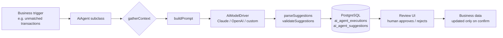

# @inobeta/ai-agent

A TypeScript framework for building structured AI agents in business applications.

**Not a wrapper. Not a chatbot SDK.** This is infrastructure for recurring business decisions that need an audit trail, human review, and the ability to swap LLM providers without touching domain logic.

---

## Built for a real problem

This framework was extracted from [Kaiboard](https://kaiboard.it), a business management application built by [Inobeta](https://inobeta.it).

The original agent — `CashFlowMatcherAgent` — handles bank reconciliation: it takes a batch of unmatched bank movements, asks Claude to suggest matches against expected cash flows with confidence scores, and surfaces them in a bulk-review UI. No suggestion is written to the database until a human confirms it.

That constraint — **the model suggests, the human decides** — is the core design principle of this framework.

Other agents built on the same pattern in Kaiboard:

- **Budget scenario assistant** — given a cost center's historical data, generates conservative/balanced/aggressive budget proposals for human review
- **Document categorization** — classifies incoming invoices against a chart of accounts, flags low-confidence cases for manual handling

The framework generalizes the pattern: any business decision that follows "given this context, suggest these actions" can be modeled as an agent subclass in under 100 lines of TypeScript.

---

## The problem it solves

Most AI integrations in business applications start as glue code: a `fetch()` to an LLM API inside a service, response parsed inline, no record of what the model suggested, no way to review before it affects data.

This breaks down when:

- You need to audit why a decision was made six months later
- The model suggests something wrong and you have no trace of the input
- You want to switch from Claude to OpenAI without rewriting business logic
- Your client's compliance team asks how AI outputs are reviewed before being applied

This framework enforces a consistent execution structure via the **Template Method pattern**:

```
gatherContext() → buildPrompt() → driver.complete() → parseSuggestions() → validateSuggestions()
                                                                ↓
                                             persisted in ai_agent_suggestions (status: pending)
```

Every run is recorded in PostgreSQL: inputs, outputs, token counts, duration, status. Suggestions stay `pending` until your application explicitly accepts or rejects them.

---

## Architecture



Three database tables ship with the framework:

| Table | Purpose |
|---|---|
| `ai_agents` | Registry of active agents, keyed by `code` |
| `ai_agent_executions` | One row per `run()` — status, timing, token counts, driver name |
| `ai_agent_suggestions` | Suggestions produced — default `status: pending` |

---

## When to use this

- You have a **recurring business decision** that can be modeled as "given this context, suggest these actions"
- You need an **audit trail** of every AI interaction without building the persistence layer yourself
- You want **human-in-the-loop** review before suggestions affect business data
- You need to **swap LLM providers** without touching domain logic

## When NOT to use this

- Simple one-off LLM calls with no persistence requirement — this adds overhead you don't need
- Streaming responses — the driver interface returns a complete `ModelResponse`
- Agentic loops where the model calls tools autonomously — this is a single-turn request/response pattern

---

## Install

```bash
npm install @inobeta/ai-agent
```

Peer dependency: `knex ^2.3.0`. You provide the Knex instance configured for your PostgreSQL database.

Apply the schema:

```bash
psql $DATABASE_URL -f node_modules/@inobeta/ai-agent/schema.sql
```

---

## Define an agent (minimal example)

```typescript
import { AiAgent } from '@inobeta/ai-agent';

class InvoiceCategorizationAgent extends AiAgent<InvoiceInput, CategorizationSuggestion> {
  constructor(knex: Knex) {
    super(knex, 'invoice-categorization');
  }

  protected async gatherContext(input: InvoiceInput) {
    return this.knex('invoices').where('id', input.invoiceId).first();
  }

  protected buildPrompt(context: unknown): string {
    const inv = context as any;
    return `Categorize this invoice. Vendor: ${inv.vendor_name}, Amount: ${inv.amount}.
    Respond with JSON: [{"categoryCode": "...", "confidence": 0.95, "reason": "..."}]`;
  }

  protected parseSuggestions(raw: string) {
    return JSON.parse(raw);
  }

  protected async validateSuggestions(suggestions: any[]) {
    return suggestions.filter(s => s.confidence >= 0.7);
  }

  protected getModelOptions() {
    return { systemPrompt: 'Respond only with valid JSON.', temperature: 0.1 };
  }
}
```

Run it:

```typescript
import { ClaudeDriver } from '@inobeta/ai-agent';

const driver = new ClaudeDriver({ apiKey: process.env.ANTHROPIC_API_KEY! });
const agent = new InvoiceCategorizationAgent(db);

const result = await agent.run({ invoiceId: 42 }, userId, driver);
// result.suggestions → typed, status: pending in DB
// result.executionId → for audit trail
// result.durationMs  → wall time including DB roundtrips
```

Full working example (no API key required): [`examples/task-priority`](./examples/)

---

## Driver abstraction

Add any LLM provider by implementing two methods:

```typescript
export interface AiModelDriver {
  complete(prompt: string, options?: ModelOptions): Promise<ModelResponse>;
  getDriverName(): string;
}
```

`ClaudeDriver` (Anthropic) is included. An OpenAI driver follows the same interface.

---

## Status

Used in production at [Inobeta](https://inobeta.it) in [Kaiboard](https://kaiboard.it).

- [x] `ClaudeDriver` (Anthropic)
- [ ] `OpenAiDriver` (planned)

MIT License.

---

## Working with this in your project

If you're integrating AI agents into an existing business application and want a structured approach — audit trail, human review, provider flexibility — feel free to reach out: [salvatore@inobeta.it](mailto:salvatore@inobeta.it)